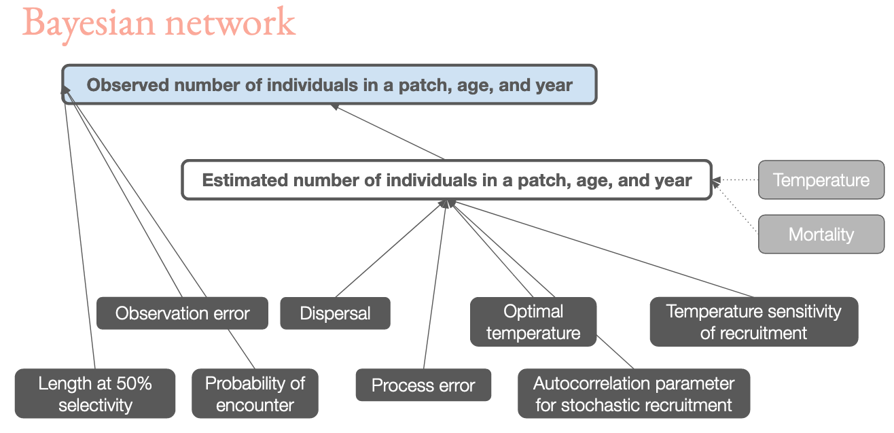

<style>
.title-slide {
vertical-align: bottom !important; 
text-align: left !important;
}
</style>


```{r setup, include=FALSE}
options(htmltools.dir.version = FALSE)
knitr::opts_chunk$set(
  fig.width=9, fig.height=3.5, fig.retina=3,
  out.width = "100%",
  cache = FALSE,
  echo = FALSE,
  message = FALSE, 
  warning = FALSE,
  fig.show = TRUE,
  hiline = TRUE
)
```

```{r xaringan-themer, include=FALSE, warning=FALSE}
library(xaringanthemer)
library(tweetrmd) 
style_duo_accent(
  primary_color = "#EBB59F",
  secondary_color = "#0B1B32",
  text_color = "#0B1B32",
  inverse_header_color = "#0B1B32",
  title_slide_text_color="#0B1B32",
  link_color = "#EBB59F",
  header_font_google = google_font("Cardo"),
  text_font_google = google_font("Work Sans"),
  code_font_google = google_font("Fira Mono")
)
```


# About our impact on the planet ... 

Yes, it's real.

Yes, it's bad.

Yes, it's us. 

No, it's not too late.

No, it isn't just climate change. 

---

# About our impact on the planet ... 


### More on climate
[IPCC report](https://www.ipcc.ch/assessment-report/ar6/), [FAQs answered](https://www.nytimes.com/article/climate-change-global-warming-faq.html), a  [docu-series](https://www.amazon.com/Years-Living-Dangerously-Complete-Showtime/dp/B00NDOXDJU), a [YouTube channel](https://www.youtube.com/channel/UCi6RkdaEqgRVKi3AzidF4ow), a [bunch](https://www.criticalfrequency.org/drilled) [of](https://www.hottakepod.com/) [podcasts](https://www.degreespod.com/)

--

###Climate scientists to follow
[Jonathan Foley](https://twitter.com/GlobalEcoGuy), [Ed Hawkins](https://twitter.com/ed_hawkins), [Katharine Hayhoe](https://twitter.com/KHayhoe), [Leah Stokes](https://twitter.com/leahstokes)

###Environmental journalists to follow
[Juliet Eilperin](https://twitter.com/eilperin), [Robinson Meyer](https://twitter.com/yayitsrob), [Kendra Pierre-Louis](https://twitter.com/KendraWrites), [Hiroko Tabuchi](https://twitter.com/HirokoTabuchi)

---

# What I do 


---

# Why R?

Really good at statistics

Facilitates transparency and reproducibility

The R ecosystem (R + RStudio + GitHub + RMarkdown + ...) enables us to [do better science in less time](https://www.nature.com/articles/s41559-017-0160) (*email me for a PDF*)

--

*Plus:* Spatial data analysis, handling netcdf files, "soup to nuts" analytical workflows, ... 

---

# Species on the move

<video>
<source src="black seabass.mp4" type="video/mp4" height="150">
</video>

Source: [OceanAdapt](https://oceanadapt.rutgers.edu)


---

# Species on the move

## 2022?


---

# Species on the move

Explaining the past $\neq$ predicting the future

Ecosystems are very, very complex 

---

# My work

**Goal:** simulating near-term shifts in species' distributions in response to temperature

--

**Problem:** our only data are annual surveys of where fish were found, and how many

--

**Solution:** fit mechanistic models to historical data to estimate process rates and simulate the future

---

# The finer details

Fitted as a hierarchical Bayesian model using [Stan](https://mc-stan.org/)

Packages: [rstan](https://mc-stan.org/users/interfaces/rstan), [rstanarm](https://mc-stan.org/rstanarm/), [tidybayes](http://mjskay.github.io/tidybayes/)

Core model features

* Spatially structured: 1° patches along a coastline
* Age structured: adults reproduce, cohorts move through ages 
* Most process rates estimated in model
* One process rate (reproduction, movement, or mortality) is temperature-dependent
* *Only fitted to historical data on abundance and distribution*
* Fitting 1972-2005, testing 2006-2015
* Competing annual forecast against different model types 

---



---

# Fitting models to data

---

# R, the planet, and you

Data about issues that matter to you is [at your fingertips](https://ropensci.org/packages/data-access/)...

--

... **But use it with caution!**

Domain knowledge matters

We're friendly. Just ask!

---
class: center, middle

# Thanks!

Slides created via the R packages:

[xaringan](https://github.com/yihui/xaringan) and [xaringanthemer](https://github.com/gadenbuie/xaringanthemer)

## Contact Information

[www.alexafredston.com](https://www.alexafredston.com/)<br>
[fredston@rutgers.edu](mailto:fredston@rutgers.edu)<br>
[@AFredston](https://twitter.com/AFredston)
